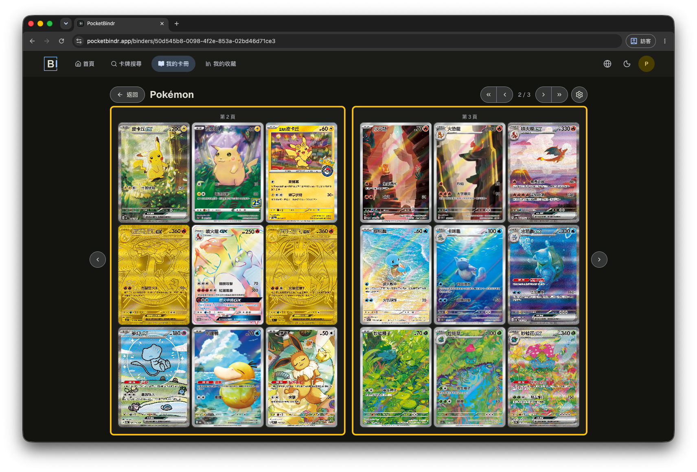
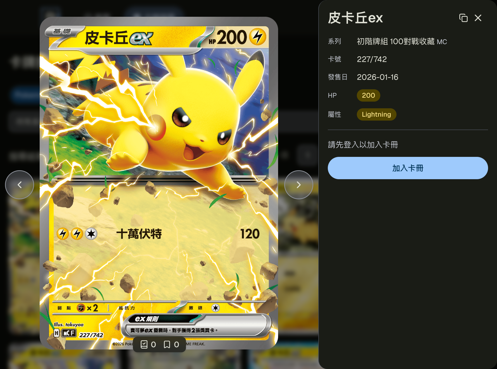
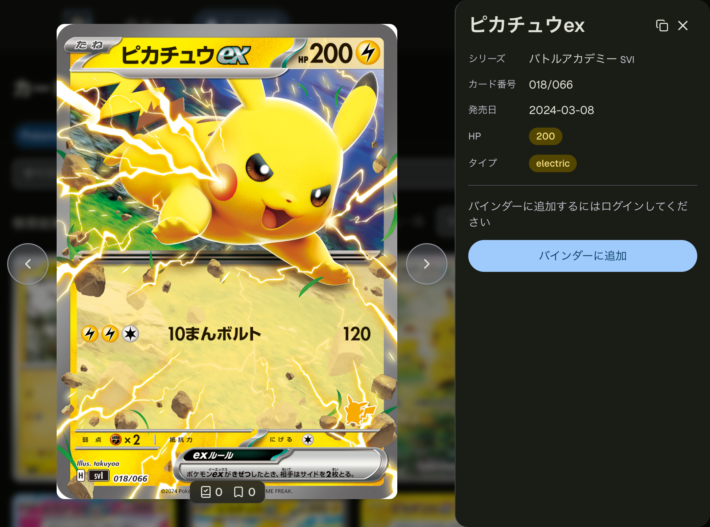
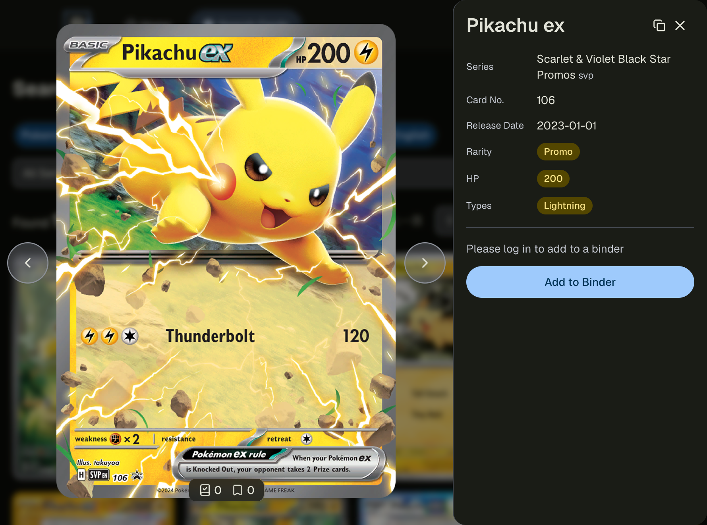
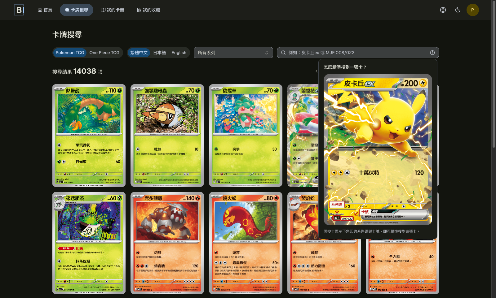
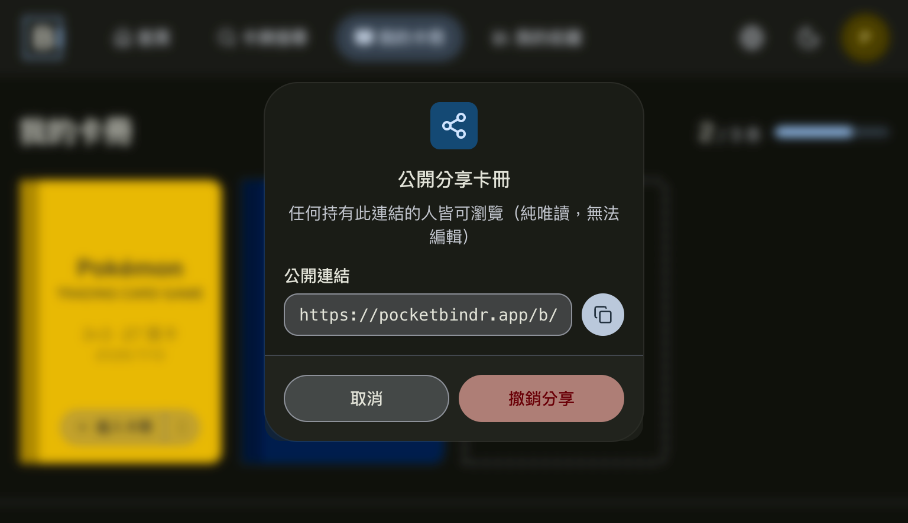

<p align="center">
  <picture>
    <source media="(prefers-color-scheme: dark)" srcset="public/logo-dark.svg">
    <source media="(prefers-color-scheme: light)" srcset="public/logo-light.svg">
    
  </picture>
</p>

<p align="center">
  
</p>

**搜尋、收藏、整理你的集換式卡牌。建立專屬卡冊，隨時掌握收藏進度。**

訪客可搜尋卡牌；登入後可標記**擁有／想要**並放入自訂格式的**卡冊（binder）**，支援雙頁展開瀏覽、
拖拉排列格位，以及唯讀公開分享連結。目前涵蓋 Pokémon TCG 與 One Piece TCG（英文 / 日文 / 繁體中文）。
每張卡皆有獨立、可分享、可被搜尋引擎索引的頁面。

🌐 **線上服務**：<https://pocketbindr.app>

## 主要功能

<table>
  <tr>
    <td width="50%" valign="top" align="center">
      <b>拖拉排列</b><br>
      以 dnd-kit 拖放卡片格位，直覺地重新安排卡冊版面。<br><br>
      
    </td>
    <td width="50%" rowspan="3" valign="top" align="center">
      <b>三語支援</b><br>
      英 / 日 / 繁中，卡牌資料與 UI 皆完整在地化。<br><br>
      <b>繁體中文</b><br>
      <br><br>
      <b>日本語</b><br>
      <br><br>
      <b>English</b><br>
      
    </td>
  </tr>
  <tr>
    <td width="50%" valign="top" align="center">
      <b>智慧搜尋</b><br>
      卡號格式提示，涵蓋 PTCG 與 One Piece TCG 的編號。<br><br>
      
    </td>
  </tr>
  <tr>
    <td width="50%" valign="top" align="center">
      <b>公開分享</b><br>
      產生唯讀公開連結，任何人無需登入即可瀏覽整本收藏。<br><br>
      
    </td>
  </tr>
</table>

## 技術棧

- **Next.js 16**（App Router, TypeScript）
- **Prisma** + **PostgreSQL**（Supabase）
- **NextAuth.js v5**（Email/密碼 ＋ Google / Discord OAuth）
- **Upstash Redis**（rate limiting）
- **Tailwind CSS** + **shadcn/ui**
- **react-hook-form** + **zod**（表單狀態與驗證，前後端共用 schema）
- **next-intl**（UI 多語言：繁中 / 英 / 日）
- **Vitest**（單元）＋ **Playwright**（E2E）
- **pnpm**

## 快速開始

需求：Node.js 22+、pnpm、一個 PostgreSQL 資料庫（建議 Supabase）。

```bash
# 1. 安裝依賴
pnpm install

# 2. 設定環境變數
cp .env.example .env.local
#   填入你自己的 DATABASE_URL / AUTH_SECRET 等（見下方「環境變數」）

# 3. 套用資料庫 schema
pnpm prisma migrate dev

# 4. 啟動開發伺服器
pnpm dev
# 開啟 http://localhost:3000
```

> 不需要任何卡牌資料就能開發 **登入 / 卡冊 / 設定 / 分享** 等功能——
> 這些流程在空卡庫下即可運作。卡牌資料的取得見下方「卡牌資料」。

## 環境變數

完整清單與說明見 [`.env.example`](./.env.example)。重點：

| 變數                                                               | 用途                                                                                                                                         | 本機開發是否必填 |
| ------------------------------------------------------------------ | -------------------------------------------------------------------------------------------------------------------------------------------- | ---------------- |
| `DATABASE_URL` / `DIRECT_URL`                                      | PostgreSQL 連線（pooled / 直連）                                                                                                             | ✅               |
| `AUTH_SECRET` / `AUTH_URL`                                         | NextAuth session 簽章與站點 URL                                                                                                              | ✅               |
| `LINK_STATE_SECRET` / `RESET_TOKEN_SECRET` / `EMAIL_VERIFY_SECRET` | OAuth 連結、密碼重設、email 驗證（含註冊強制驗證與純 OAuth 補填 email）的 HMAC 簽章密鑰（各自獨立、lazy 載入）；`EMAIL_VERIFY_SECRET` 為 email/password 註冊必經路徑，需先設定否則註冊會失敗 | 選填（`EMAIL_VERIFY_SECRET` 若要測試 email/password 註冊則必填） |
| `UPSTASH_REDIS_REST_URL` / `_TOKEN`                                | rate limiting                                                                                                                                | ✅               |
| `GOOGLE_*` / `DISCORD_*`                                           | 社群登入（不需要可留空，改用 Email/密碼）                                                                                                    | 選填             |
| `RESEND_API_KEY`                                                   | 寄送密碼重設信、註冊驗證信、email 補填驗證信、缺卡/bug 回報信；設為 `test` 可跳過真實寄信                                                    | 選填             |
| `REPORT_TO_EMAIL`                                                  | 缺卡/bug 回報的收件信箱                                                                                                                      | 選填             |
| `SUPABASE_URL` / `SUPABASE_SERVICE_ROLE_KEY`                       | Storage 金鑰：本機維護腳本 + runtime 頭像上傳皆用                                                                                            | 選填             |

> ⚠️ `.env` / `.env.local` 已被 `.gitignore` 排除，請勿提交任何真實金鑰。

## 卡牌資料

新 clone 的資料庫是空的。各資料源的取得方式不同：

- **PTCG（英文）**：來自公開的 [pokemontcg.io](https://pokemontcg.io) API，無需 API key 即可請求、自行同步。
- **PTCG（日文 / 繁中）、One Piece TCG（全語言）**：來自各官方網站，依賴**未隨本專案散布**的內部維護腳本，
  外部開發者無法直接重建這批資料。

因此若要開發**依賴實際卡牌的功能**（搜尋、加入卡冊），建議自行匯入少量測試卡牌；
其餘功能在空卡庫下即可開發與測試。卡牌圖片版權屬各發行商所有，本專案不散布任何卡牌圖片。

## 測試

```bash
pnpm test          # 單元測試（Vitest）
pnpm test:e2e      # E2E 測試（Playwright，會以 production build 啟動站點）
pnpm test:e2e:ui   # E2E 互動式 UI
```

E2E 以 `pnpm build && pnpm start` 啟動正式 build（非 dev mode），並需要可連線的資料庫與必填環境變數。

> ⚠️ E2E 會實際寫入資料庫，請務必指向**獨立的測試資料庫**，切勿指向正式 / 生產環境。

## 部署

部署於 Vercel（function region 釘東京 `hnd1` 對齊 Supabase `ap-northeast-1`，見 [`vercel.json`](./vercel.json)）。
正式環境需設定上表所有必填變數，並將 `AUTH_TRUST_HOST` 設為 `true`。

## 貢獻

歡迎貢獻。請先閱讀 [貢獻指南](./.github/CONTRIBUTING.md)；架構概覽見 [ARCHITECTURE.md](./ARCHITECTURE.md)。
回報安全性問題請見 [SECURITY.md](./.github/SECURITY.md)。

## 授權與免責

本專案程式碼以 [MIT License](./LICENSE) 授權。

本專案為個人 / 教育用途的卡牌收藏管理工具，與 The Pokémon Company、Nintendo、Bandai 等公司**無任何關聯**，
亦未獲其授權或贊助。所有卡牌名稱、圖片與相關資料之著作權與商標權均屬各自權利人所有。

服務條款與隱私權政策（繁中 / 英 / 日）請見網站頁尾連結（`/terms`、`/privacy`）。
